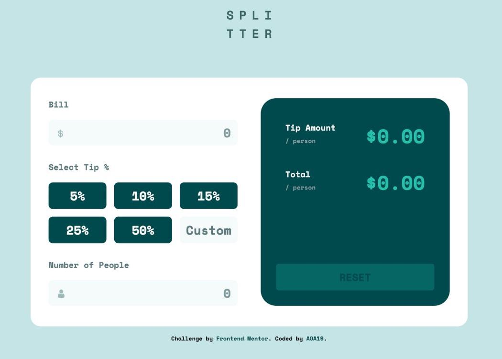
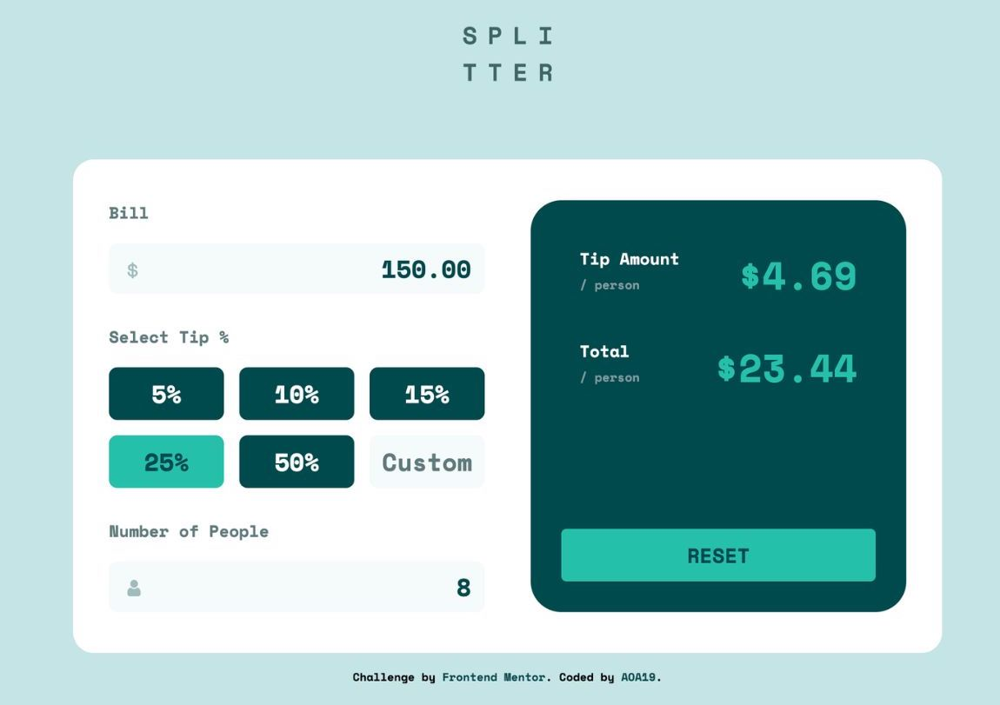
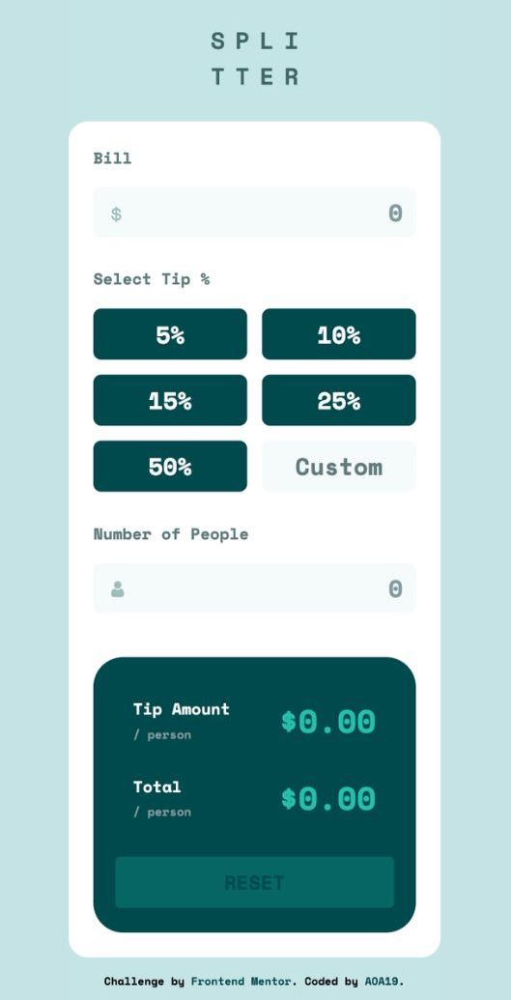

# Frontend Mentor - Tip calculator app solution

Out to dinner with friends and struggling to calculate the proper tip? Put down that pen and paper and use the Splitter Tip Calculator to determine the tip and total per-person amounts. 
This app was created for the the [Tip calculator app challenge on Frontend Mentor](https://www.frontendmentor.io/challenges/tip-calculator-app-ugJNGbJUX)

## Table of contents

- [Overview](#overview)
  - [The challenge](#the-challenge)
  - [Screenshot](#screenshot)
  - [Links](#links)
- [My process](#my-process)
  - [Built with](#built-with)
  - [Useful resources](#useful-resources)
- [Author](#author)
- [Acknowledgments](#acknowledgments)

## Overview

### The challenge

Users should be able to:

- View the optimal layout for the app depending on their device's screen size
- See hover states for all interactive elements on the page
- Calculate the correct tip and total cost of the bill per person

### Screenshot

### Links

- [Soultion URL](https://github.com/AOA19/TipCalculatorApp)
- [Live Site URL](https://aoa19.github.io/TipCalculatorApp/)

## My process

### Built with

- Semantic HTML5 markup
- CSS custom properties
- Flexbox
- CSS Grid
- Vanilla JavaScript
- Mobile-first workflow

### Useful resources
I was having trouble with disabling the reset button whenever the calculator was empty. The following article and video helped me to complete this task.
- [CSS Tricks](https://css-tricks.com/making-disabled-buttons-more-inclusive/) - Making Disabled Buttons More Inclusive 
- [Web Dev Junkie](https://youtu.be/ge0T4Fl6M3A) - How to disable a form button using JavaScript, HTML, and. CSS

## Author

- Github: [@AOA19](https://github.com/AOA19)
- Frontend Mentor: [@AOA19](https://www.frontendmentor.io/profile/AOA19)

## Acknowledgments

Thank you to these project solutions that helped me while I worked on this project:
- Credit: [Fernando0654](https://github.com/Fernando0654/FEM_1_Tip_Calculator)
- Credit: [haikalmol](https://github.com/haikalmol/Tip-Calculator)

